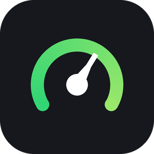
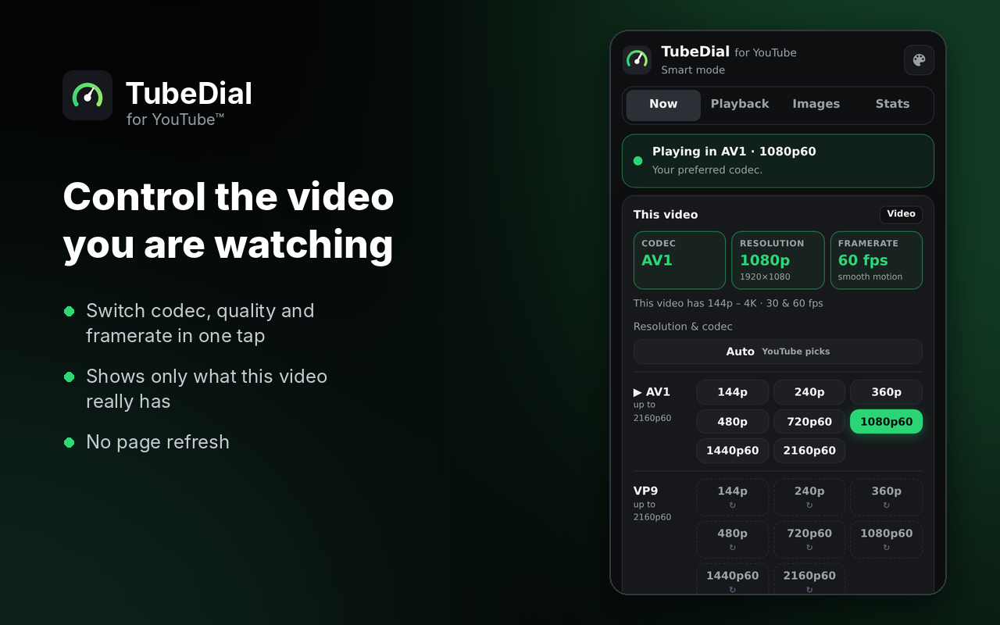

<h1 align="center">TubeDial</h1>

Control framerate, resolution and codec on YouTube — for the highest quality or the lowest internet usage.

## Features

- **Codec** — prefer AV1, VP9 or H.264. AV1 gives the same picture for less data.
- **Starting quality** — pick the quality videos, Shorts, live streams and embeds start at.
- **Framerate limit** — e.g. 30 fps for slower computers.
- **Now tab** — see and switch the current video's codec, quality and framerate, without refreshing.
- **Lighter images** — smaller thumbnails and hover previews, or turn previews off.
- **Presets** — Smart, Data saver, Max savings, Best quality, Smooth.

## Install

1. Download **TubeDial-v1.0.zip** from [Releases](../../releases/latest) and unzip it.
2. Open `brave://extensions` (or `chrome://extensions`).
3. Turn on **Developer mode**.
4. Click **Load unpacked** and select the **TubeDial** folder.

Works in Brave, Chrome, Edge, Opera and Vivaldi on computers.

## Privacy

TubeDial collects nothing, sends nothing and makes no network requests. Settings stay in your browser.
It doesn't block ads or download videos — it only chooses among the formats YouTube already provides.

## Contributing

Free for everyone: use it, change it, fix it, share it — no rules ([public domain](LICENSE)).
Found a bug or have an idea? Open an [issue](../../issues). Want to improve it? Send a pull request.

Tests: `cd tests && npm install && npm test`

---

Not affiliated with YouTube or Google. YouTube is a trademark of Google LLC.
